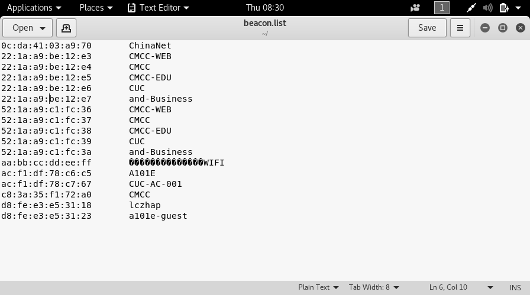
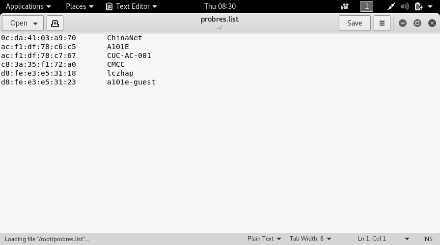
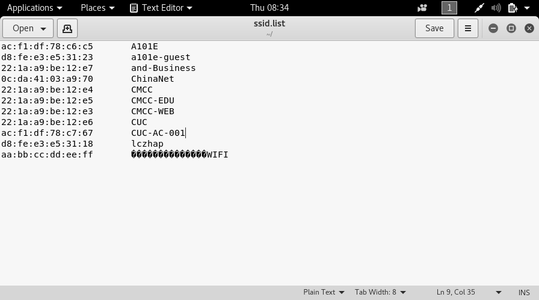
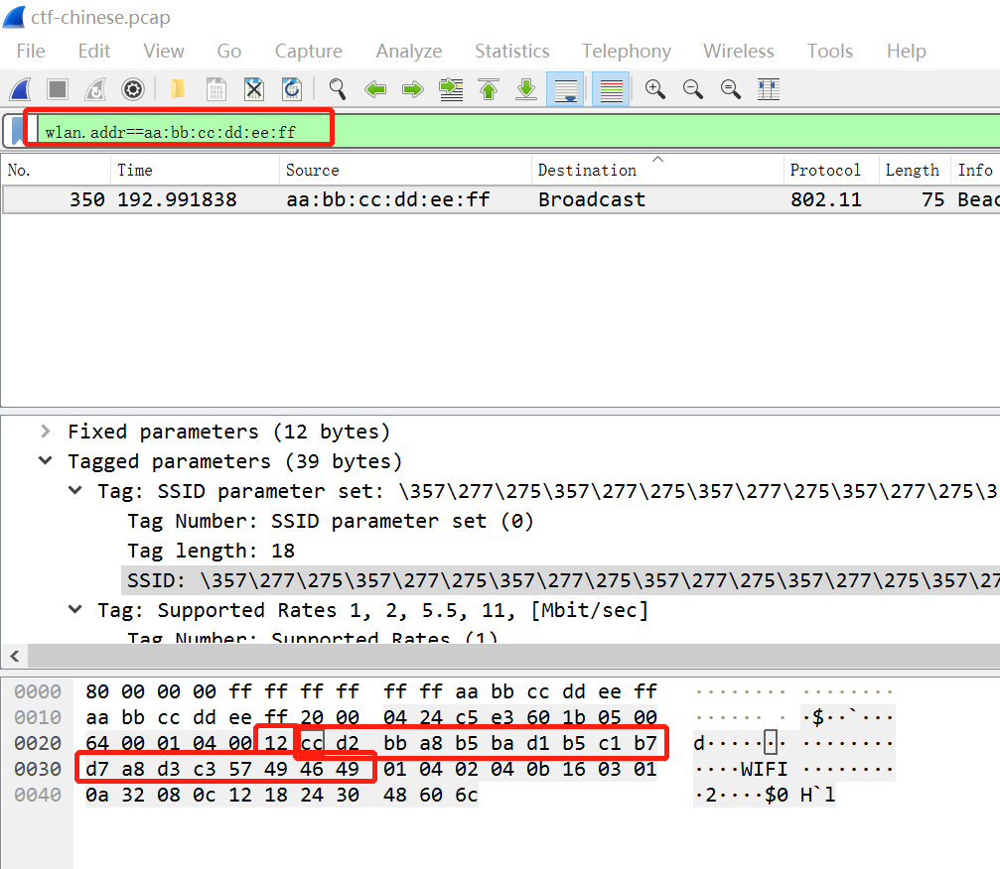

### 实验内容：
分析附件提供的pcap中有多少可用AP？将不重复的SSID提交到以下网址，获取通关flag。

http://sec.cuc.edu.cn/ctf/backend/wifi_hacking/ssid.html

### 实验背景：
pcap包格式：

Pcap Header | Pcacket Header1|Pcaket Data1|Packet Header2|Packet Data2|~
---|---|---|---|---|---
==SSID:==   
SSID是Service Set Identifier的缩写，意思是：服务集标识。SSID技术可以将一个无线局域网分为几个需要不同身份验证的子网络，每一个子网络都需要独立的身份验证，只有通过身份验证的用户才可以进入相应的子网络，防止未被授权的用户进入本网络。

### 实验过程

```
tshark -r ctf-chinese.cap -Y wlan.fc.type_subtype==0x08 -T fields -e wlan.sa  -e wlan.ssid | sort -d -u > beacon.list
# wlan.fc.type_subtype==0x08AP是信标帧，周期性宣告自身的存在，并为无线网卡提供SSID和其他信息
# -Y 筛选器
# -T 输出格式
# -e 如果-T选择了field，此项用来选择
# -d 排序时，处理英文字母、数字及空格字符外，忽略其他的字符；
# -u 忽略相同行
```


```
tshark -r ctf-chinese.cap -Y wlan.fc.type_subtype==0x05 -T fields -e wlan.sa  -e wlan.ssid| sort -d -u > probres.list
# wlan.fc.type_subtype==0x05AP是探测响应帧，AP发送，包含接受/拒绝回应，还包含建立关联所需的信息
```


```
sort -m probres.list beacon.list | sort -k2 -u > ssid.list
# -m 合并文件，不排序
# -k2 -u 根据第二列的值进行合并去重
```


我们注意到ssid.list里面有一个乱码，我们已经知道了这个ssid的mac地址，现在我们可以直接到wireshark里面查找。

然后我们可以利用python把16进制转换为汉字。

```
Code=[]
CodeA=[]
def readGrammar():
    file = open('result.txt', 'r')
    for line in file:
        line = line.replace('\n', "")
        Code.append(line)
    file.close()
    return Code
if __name__=="__main__":
    readGrammar()
    for i in Code:
        i=i.split("\t")
        CodeA.append(i[2])
    for j in CodeA:
        print(j)
    print(str(b'\xcc\xd2\xbb\xa8\xb5\xba\xd1\xb5\xc1\xb7\xd7\xa8\xd3\xc3\x57\x49\x46\x49', 'gbk'))
```


```
#输出答案为：
A101E
a101e-guest
and-Business
ChinaNet
CMCC
CMCC-EDU
CMCC-WEB
CUC
CUC-AC-001
lczhap
??????????????WIFI
桃花岛训练专用WIFI
```
