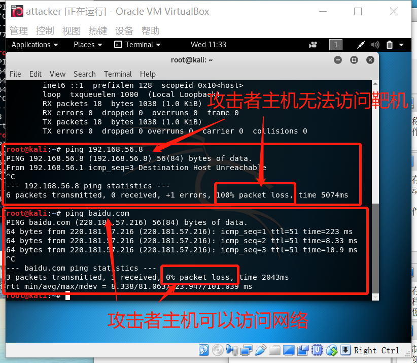

#  chap0x01 基于VirtualBox的网络攻防基础环境搭建
- 节点：靶机、网关、攻击者主机    
   
   
   
   
- 连通性   
  - 靶机可以直接访问攻击者主机   
    
  - 攻击者主机无法直接访问靶机   
    
  - 网关可以直接访问攻击者主机和靶机  
    
  - 靶机的所有对外上下行流量必须经过网关   
    当靶机访问攻击者主机时，从网关上监测到的eth0和eth1的数据。  
      
       
      
    当靶机访问网络的时候，从网关上监测到的eth0和eth1的数据。      
       
        
        
    从上面的网卡的监测来看，靶机的所有上下流量都经过了网关。
  - 所有节点均可以访问互联网   
      
       
   
- 其他要求
  - 所有节点制作成基础镜像（多重加载的虚拟硬盘）    
     

### 配置过程及问题：
###### 1.创建完虚拟机之后,攻击者主机不需要配置ip地址。靶机的网卡信息为空，网关的双网卡中一个信息为空。需要手动配置信息。
- 在端口中输入：  
     
```
vi /etc/network/interfaces
//vi代表编辑，后买你则是文件路径
```
- 输入代码按下回车键后，点击‘a’就能编辑配置网卡信息：  
  
   
###### 2.配置完ip地址后，你会发现你的电脑无法ping通，这时候就需要对网关进行配置。
- 在端口中输入：   

```
  echo 1 > /proc/sys/net/ipv4/ip_forward
  //开启ipv4的转发功能
  route add -net 10.0.2.0 netmask 255.255.255.0 dev eth0
  //取消对/etc/sysctl.conf文件里的net.ipv4.ip_forward=1的注释
```
- 在没有配置NAT之前，eth0转发ip包原地址仍然是靶机的IP地址，进行了设置之后，eth0转发后源地址改成eth0的IP地址。在端口中输入：   

```
iptables -t nat -A POSTROUTING -o eth0 -s 192.168.56.0/24 -j MASQUERADE
//192.168.56.0/24是网关和靶机所在的网段
```
###### 3.可以ping百度的话，直接输入ping百度的域名是错误的，但是可以ping通百度的ip地址。
- 修改dns域名解析服务器
   - 打开/etc/resolv.conf
   - 进行以下编辑    
