## 无线网络监听实验

### 1.实验环境

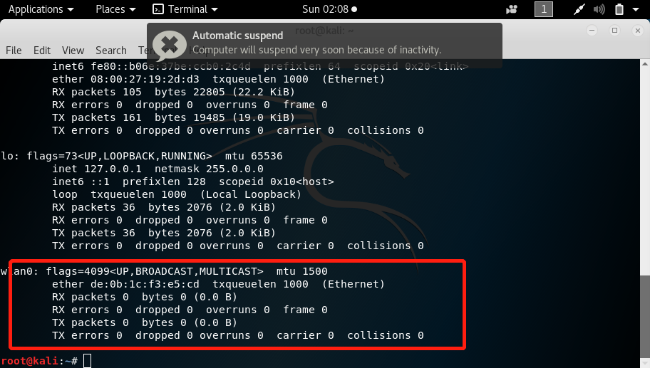

将网卡模式设置为监听模式

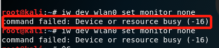

当出现以上问题的时候

使用以下口令来解决，这时我们就能看到网卡为监听模式

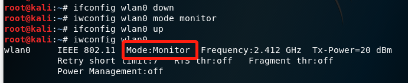

查看附近网络的ssid

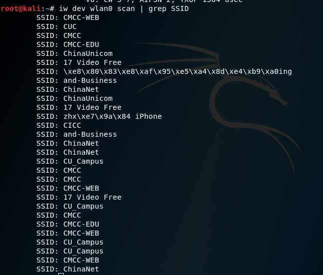查看附近无线网络的SSID，自动处理UTF-8编码的SSID名称

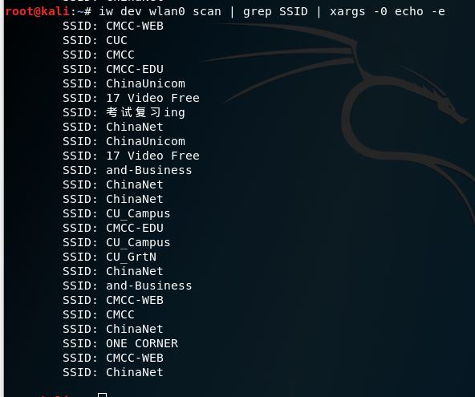

### 2.抓包

- 抓包

```
airodump-ng wlan0 17 -w
#抓包并将包存在名为17的文件中
```

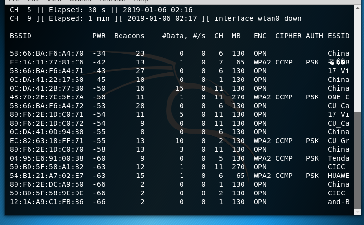

### 3.分析包

- 根据Beacon帧获得ssid

```
tshark -r 17-01.cap -Y wlan.fc.type_subtype==0x08 -T fields -e wlan.sa -e wlan.fixed.capabilities.privacy -e wlan.ssid | sort -d -u > beacon.list
```

beacon.list

```00:27:1d:06:c6:76	0	CMCC-WEB
00:27:1d:08:c6:74	0	and-Business
00:27:1d:08:c6:76	0	and-Business
00:27:1d:0e:01:81	0	CMCC-WEB
00:27:1d:0e:02:26	0	CMCC-WEB
00:27:1d:0e:03:79	0	CMCC-WEB
00:27:1d:0e:0b:6b	0	CMCC-WEB
00:27:1d:0e:0c:18	0	CMCC-WEB
00:27:1d:0f:01:81	1	CMCC
00:27:1d:0f:01:d2	1	CMCC
00:27:1d:0f:02:26	1	CMCC
00:27:1d:0f:03:79	1	CMCC
00:27:1d:0f:0b:6b	1	CMCC
00:27:1d:0f:0c:18	1	CMCC
00:27:1d:10:01:81	0	and-Business
00:27:1d:10:02:26	0	and-Business
00:27:1d:10:03:79	0	and-Business
00:27:1d:10:0b:6b	0	and-Business
00:27:1d:10:0c:18	0	and-Business
04:95:e6:91:00:b8	1	Tenda_9100B8
0c:da:41:03:bb:10	0	ChinaNet
0c:da:41:0d:94:30	0	ChinaNet
0c:da:41:0d:98:50	0	ChinaNet
0c:da:41:0d:ac:30	0	ChinaNet
0c:da:41:22:17:50	0	ChinaNet
0c:da:41:22:1a:50	0	ChinaNet
0c:da:41:22:28:50	0	ChinaNet
0c:da:41:2b:77:b0	0	ChinaNet
12:1a:a9:c1:f8:e2	0	CMCC-WEB
12:1a:a9:c1:f8:e3	1	CMCC
12:1a:a9:c1:f8:e4	0	CMCC-EDU
12:1a:a9:c1:f8:e5	0	CUC
12:1a:a9:c1:f8:e6	0	and-Business
20:6b:e7:23:e8:76	1	dayin
48:7d:2e:7c:5e:7a	1	ONE CORNER
50:bd:5f:58:9e:9c	0	CICC
50:bd:5f:58:a1:4e	0	CICC
50:bd:5f:58:a1:76	0	CICC
50:bd:5f:58:a1:82	0	CICC
54:b1:21:a7:02:e7	1	HUAWEI-02E7
58:66:ba:f6:a4:70	0	ChinaUnicom
58:66:ba:f6:a4:71	0	17 Video Free
58:66:ba:f6:a4:72	0	CU_Campus
80:f6:2e:13:b7:f0	0	ChinaUnicom
80:f6:2e:13:b7:f1	0	17 Video Free
80:f6:2e:13:b7:f2	0	CU_Campus
80:f6:2e:13:b9:30	0	ChinaUnicom
80:f6:2e:13:b9:31	0	17 Video Free
80:f6:2e:13:b9:32	0	CU_Campus
80:f6:2e:15:97:b0	0	ChinaUnicom
80:f6:2e:15:97:b1	0	17 Video Free
80:f6:2e:15:97:b2	0	CU_Campus
80:f6:2e:1d:c0:70	0	ChinaUnicom
80:f6:2e:1d:c0:71	0	17 Video Free
80:f6:2e:1d:c0:72	0	CU_Campus
80:f6:2e:1e:27:30	0	ChinaUnicom
80:f6:2e:1e:27:31	0	17 Video Free
80:f6:2e:1e:27:32	0	CU_Campus
80:f6:2e:1e:28:10	0	ChinaUnicom
80:f6:2e:dc:5f:f0	0	ChinaNet
80:f6:2e:dc:a9:50	0	ChinaNet
80:f6:2e:dc:bc:d0	0	ChinaNet
8c:a6:df:66:f0:37	1	416������������
8c:a6:df:81:3b:4b	1	412
d0:76:e7:65:a1:5d	1	���CUC���������wifi
d0:76:e7:9b:71:92	1	������������������������Wi-Fi
d2:1a:a9:c2:0f:32	0	and-Business
d2:1a:a9:c2:0f:3e	0	CMCC-WEB
e4:0e:ee:31:c1:81	1	
e4:f3:f5:05:48:36	1	E304
e4:f3:f5:12:9c:10	1	MERCURY_104
ec:82:63:18:ff:71	1	CU_GrtN
fc:d7:33:d7:db:12	1	TP-LINK_DB12
fe:1a:11:77:81:c6	1	������������ing
```

- 根据Probe Response获得SSID

```   tshark -r capture.cap -Y wlan.fc.type_subtype==0x05 -T fields -e wlan.sa -e wlan.fixed.capabilities.privacy -e wlan.ssid| sort -d -u > probres.list
   tshark -r 17-01.cap -Y wlan.fc.type_subtype==0x05 -T fields -e wlan.sa -e wlan.fixed.capabilities.privacy -e wlan.ssid| sort -d -u > probres.list
```

probres.list

```
00:27:1d:0e:01:81	0	CMCC-WEB
00:27:1d:0e:03:79	0	CMCC-WEB
00:27:1d:0f:01:81	1	CMCC
00:27:1d:0f:03:79	1	CMCC
00:27:1d:10:01:81	0	and-Business
00:27:1d:10:03:79	0	and-Business
04:95:e6:91:00:b8	1	Tenda_9100B8
0c:da:41:0d:99:b0	0	ChinaNet
0c:da:41:22:17:50	0	ChinaNet
0c:da:41:22:1a:50	0	ChinaNet
0c:da:41:2b:77:b0	0	ChinaNet
20:6b:e7:23:e8:76	1	dayin
3e:36:bb:e1:93:37	1	������������ iPhone
48:7d:2e:7c:5e:7a	1	ONE CORNER
50:bd:5f:58:a1:76	0	CICC
58:66:ba:f6:a4:70	0	ChinaUnicom
58:66:ba:f6:a4:71	0	17 Video Free
58:66:ba:f6:a4:72	0	CU_Campus
80:f6:2e:1d:c0:70	0	ChinaUnicom
80:f6:2e:1d:c0:71	0	17 Video Free
80:f6:2e:1d:c0:72	0	CU_Campus
80:f6:2e:1e:27:30	0	ChinaUnicom
80:f6:2e:1e:27:31	0	17 Video Free
80:f6:2e:1e:27:32	0	CU_Campus
80:f6:2e:dc:5f:f0	0	ChinaNet
b6:bf:2d:80:1a:2b	1	Yuzhan��� iPhone
e4:f3:f5:05:48:36	1	E304
ec:82:63:18:ff:71	1	CU_GrtN
fc:d7:33:d7:db:12	1	TP-LINK_DB12
fe:1a:11:77:81:c6	1	������������ing
```

- 将Beacon、Probe Response中的SSID进行合并，同名SSID只取一个

```
   sort -m probres.list beacon.list | sort -k3 -u > ssid.list
```

ssid.list

```e4:0e:ee:31:c1:81	1	
58:66:ba:f6:a4:71	0	17 Video Free
8c:a6:df:81:3b:4b	1	412
8c:a6:df:66:f0:37	1	416������������
00:27:1d:08:c6:74	0	and-Business
0c:da:41:03:bb:10	0	ChinaNet
58:66:ba:f6:a4:70	0	ChinaUnicom
50:bd:5f:58:9e:9c	0	CICC
00:27:1d:0f:01:81	1	CMCC
12:1a:a9:c1:f8:e4	0	CMCC-EDU
00:27:1d:06:c6:76	0	CMCC-WEB
12:1a:a9:c1:f8:e5	0	CUC
58:66:ba:f6:a4:72	0	CU_Campus
ec:82:63:18:ff:71	1	CU_GrtN
20:6b:e7:23:e8:76	1	dayin
e4:f3:f5:05:48:36	1	E304
54:b1:21:a7:02:e7	1	HUAWEI-02E7
e4:f3:f5:12:9c:10	1	MERCURY_104
48:7d:2e:7c:5e:7a	1	ONE CORNER
04:95:e6:91:00:b8	1	Tenda_9100B8
fc:d7:33:d7:db:12	1	TP-LINK_DB12
b6:bf:2d:80:1a:2b	1	Yuzhan��� iPhone
d0:76:e7:65:a1:5d	1	���CUC���������wifi
fe:1a:11:77:81:c6	1	������������ing
3e:36:bb:e1:93:37	1	������������ iPhone
d0:76:e7:9b:71:92	1	������������������������Wi-Fi
```

- 将文件中出现的乱码进行整理

我们从ssid中找到有乱码的mac地址

然后我们去wireshark中找到它的ssid

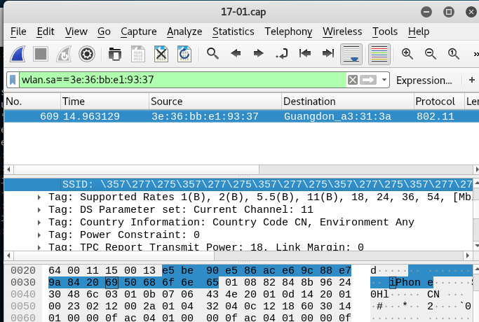

然后通过在线转译工具转化为字符串

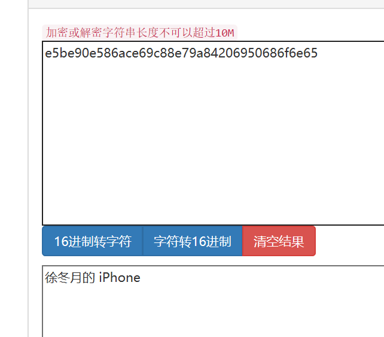

然后文件中出现的乱码从上到下是

```416五环六少
416五环六少
Yuzhan的 iPhone
全CUC最酷的wifi
考试复习ing
徐冬月的ipone
猛哥带领下的宿舍Wi-Fi

```

### 4.问题解答

- 解析文件中有多少个独立的ssid

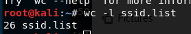

- 在抓到中包不包含隐藏的SSID

我们可以看到ssid的第一个为空

取它的mac地址去看

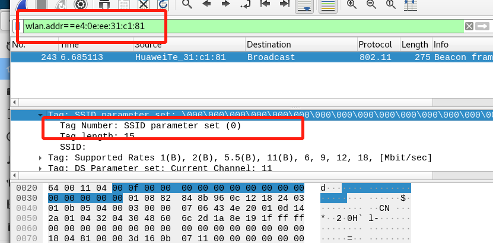

- Beacon帧的wlan.fixed.capabilities.privacy为1是加密，为0是未加密

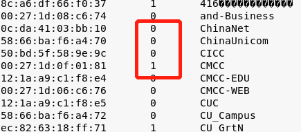

- 认证帧的wlan.fixed.auth.alg为0是加密方式为OpenSystem，为1是加密方式SharedKey

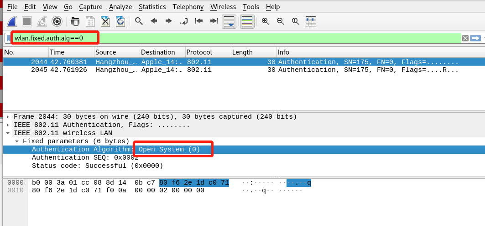

- 如何分析出一个指定手机在抓包时间窗口内在手机端的无线网络列表可以看到哪些SSID？

```
wlan.fc.type_subtype==0x08
```

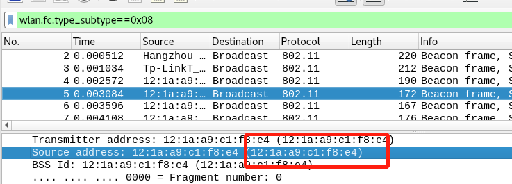

由mac地址我们可以从ssid中找到

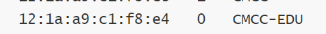

-  某台手机尝试连接了哪些SSID？

```
wlan.fc.type_subtype==0x05&&wlan.addr==这台手机的MAC地址
```

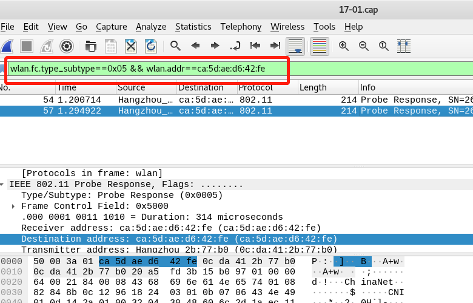

- 某台手机最终连入哪些ssid

```
 wlan.fc.type_subtype==0x01&&wlan.addr==手机的MAC地址
```

从实验我们可以看到这台手机最终没有加入任何ssid

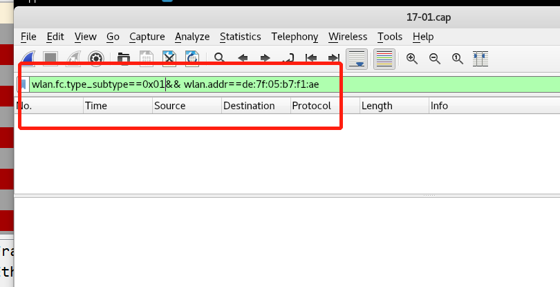