## 编程实现并讲解

-  TCP connect scan
-  TCP stealth scan
-  TCP XMAS scan
-  UDP scan

### 1.实验环境

攻击者主机(10.0.2.4)

靶机(10.0.27)

### 2.TCP connect scan

- 当端口扫描服务端与客户端连接不成功时


在kali上执行`python tcp.py`

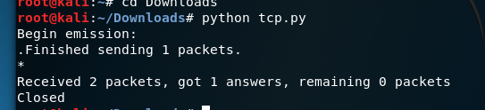

执行`namp 10.0.2.6`

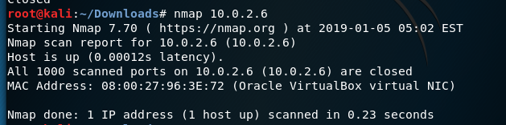

抓到的包用wireshark分析

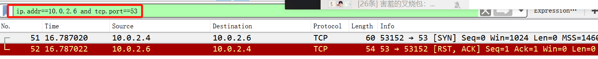

- 当端口扫描服务端与客户端连接成功时


在靶机上打开80端口

`miteproxy -p 80 `

然后在攻击者主机上执行


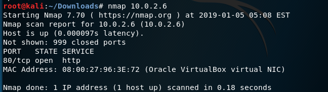

用wiresahrk分析

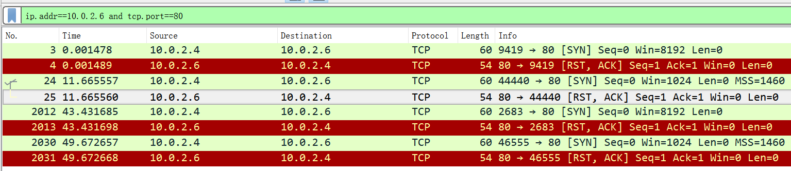


### 3.UDP scan

端口开放时


端口关闭时


无法判断情况


端口开放或者被过滤


在靶机上执行`nc -ulp 53`

在主机上执行`python udp.py`

在主机上执行`nmap 10.0.2.6`

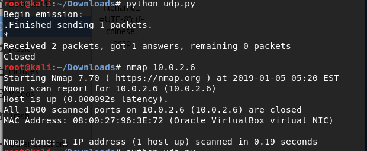

用wireshark分析抓到的包

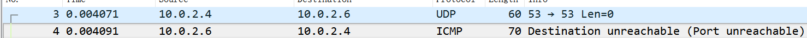

### 4.TCP sealth  scan

端口开放时


端口关闭时


在靶机上打开80端口

`mitmproxy -p 80`

在主机上执行如下指令

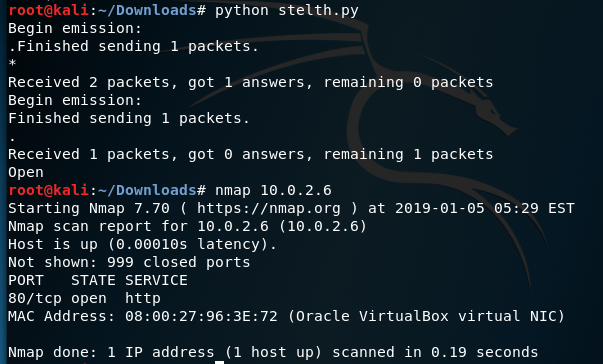

用wireshark分析抓到的包

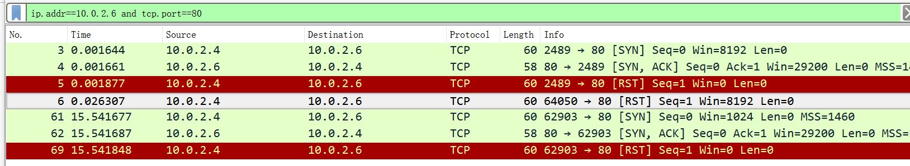

### 5.XMAS scan

端口开放时


端口关闭时

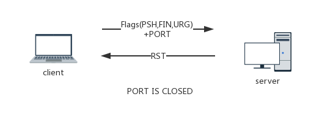

无法判断情况


在靶机上执行`mitmproxy -p 80`

在主机上执行

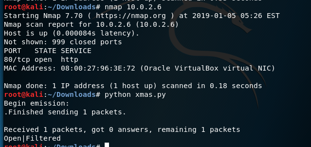

用wireshark分析抓到的包

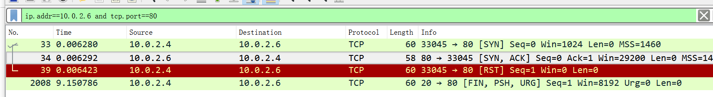

### 6.源代码

- TCP scan

```
import logging

logging.getLogger("scapy.runtime").setLevel(logging.ERROR)

from scapy.all import *


dst_ip = "10.0.2.6"

src_port = RandShort()

dst_port=80


tcp_connect_scan_resp = sr1(IP(dst=dst_ip)/TCP(sport=src_port,dport=dst_port,flags="S"),timeout=10)

if(str(type(tcp_connect_scan_resp))=="<type 'NoneType'>"):

    print ("Closed")

elif(tcp_connect_scan_resp.haslayer(TCP)):

    if(tcp_connect_scan_resp.getlayer(TCP).flags == 0x12):

        send_rst = sr(IP(dst=dst_ip)/TCP(sport=src_port,dport=dst_port,flags="AR"),timeout=10)

        print ("Open")

    elif (tcp_connect_scan_resp.getlayer(TCP).flags == 0x14):\

        print ("Closed")
```

- TCP stealth scan

```import logging


logging.getLogger("scapy.runtime").setLevel(logging.ERROR)

from scapy.all import *


dst_ip = "10.0.2.6"

src_port = RandShort()

dst_port = 80


pkt = IP(dst=dst_ip) / TCP(sport=src_port, dport=dst_port, flags="S")

pkt1 = IP(dst=dst_ip) / TCP(sport=src_port, dport=dst_port, flags="R")


stealth_scan_resp = sr1(pkt, timeout=10)


if (str(type(stealth_scan_resp)) == "<type 'NoneType'>"):

    print("Filtered")

elif (stealth_scan_resp.haslayer(TCP)):

    if (stealth_scan_resp.getlayer(TCP).flags == 0x12):

        send_rst = sr(pkt1, timeout=10)

        print("Open")

    elif (stealth_scan_resp.getlayer(TCP).flags == 0x14):

        print("Closed")

elif (stealth_scan_resp.haslayer(ICMP)):

    if (int(stealth_scan_resp.getlayer(ICMP).type) == 3 and int(stealth_scan_resp.getlayer(ICMP).code) in [1, 2, 3, 9, 10, 13]):

        print("Filtered"
       
```

- UDP scan

```import logging

logging.getLogger("scapy.runtime").setLevel(logging.ERROR)

from scapy.all import *


dst_ip = "10.0.2.6"

src_port = RandShort()

dst_port=53

dst_timeout=10


udp_scan_resp = sr1(IP(dst=dst_ip) / UDP(dport=dst_port), timeout=dst_timeout)

if (str(type(udp_scan_resp)) == "<type 'NoneType'>"):

    print("Open|Filtered")

elif (udp_scan_resp.haslayer(UDP)):

    print("Open")

elif (udp_scan_resp.haslayer(ICMP)):

    if (int(udp_scan_resp.getlayer(ICMP).type) == 3 and int(udp_scan_resp.getlayer(ICMP).code) == 3):

        print("Closed")

    elif (int(udp_scan_resp.getlayer(ICMP).type) == 3 and int(udp_scan_resp.getlayer(ICMP).code) in [1, 2, 9, 10, 13]):

        print("Filtered")
```

- XMAS scan

```import logging


logging.getLogger("scapy.runtime").setLevel(logging.ERROR)

from scapy.all import *


dst_ip = "10.0.2.6"

src_port = RandShort()

dst_port = 80


pkt = IP(dst=dst_ip) / TCP(dport=dst_port, flags="FPU")


xmas_scan_resp = sr1(pkt, timeout=10)

if (str(type(xmas_scan_resp)) == "<type 'NoneType'>"):

    print("Open|Filtered")

elif (xmas_scan_resp.haslayer(TCP)):

    if (xmas_scan_resp.getlayer(TCP).flags == 0x14):

        print("Closed")

elif (xmas_scan_resp.haslayer(ICMP)):

    if (int(xmas_scan_resp.getlayer(ICMP).type) == 3 and int(xmas_scan_resp.getlayer(ICMP).code) in [1, 2, 3, 9, 10, 13]):

        print("Filtered")
```