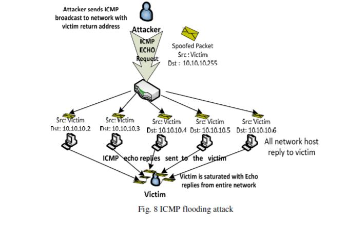

# 基于云的大规模DDoS攻击缓解方案

### 摘要

现在，DDoS攻击已经达到了千兆宽带。僵尸网络和以前常用的DDoS缓解和保护方案已经起不了作用。此次调研，首先对Spamhaus.org上当前最大的超过300Gbps的DNS映射攻击进行了深入了解。接下来回顾并分析了由hacktivists发起的当前最流行的DDoS攻击类型。最后，讨论了专家和基于云计算的DDoS服务提供商提出的有效的基于云计算的DDos缓解和保护技术。

### 关键词

DoS，DDoS, DNS 映射和扩大攻击， SYN 洪水， UDP 洪水, ICMP 洪水, HTTP 洪水攻击

### 1.引言

2013年3月，Spamhaus.org遭受到了历史以来最严重的DDoS攻击，这次攻击估计超过了300Gbps。CloudFlare采用基于云的DDoS攻击的保护和缓解方案来减轻这种攻击。根据Prolexic 2013年第一季度全球DDoS攻击报告，超过10%的大规模DDoS攻击超过了60Gbps，超过%75的攻击针对第三层和第四层的基础设施，包括带宽和路由；其余的攻击则是针对应用层。

在DDoS攻击中，攻击者试图去暂时中断或者暂停网站的服务，使得用户不能使用网站。Akamai在2012年第四季度的网络状态报告中称，2012年网络上总共报告了768次攻击。其中超过三分之一（269或35%）的攻击针对的是商业公司，164次（22%）的攻击针对的是传媒和娱乐公司，155次（20%）攻击针对的包括金融服务类的其他公司，70次（9%）的攻击针对的是公共部门机构。这些攻击造成了公司和组织金钱、客户满意度、品牌效应方面的损失。

这次调查旨在提供完整更新当前大规模DDoS攻击类型，并讨论各种有效的基于云的DDoS缓解和保护技术。在文章的第二个部分，我们首先详细分析了当前对Spamhaus最大的的DDoS攻击。然后我们在第三部分讨论当前最热门的第三层和第四层的基础结构和应用层攻击类型。第四部分则属讨论了各种有效的基于云的DDoS缓解和保护技术。最后，我们在第五部分给出了我们的结论。

### 2.SPAMHAUS的DDos攻击历史

2013年3月18号，一个名为Spamhaus.org的提供邮件垃圾过滤服务的网站，遭受了超过100Gbps的大规模DDoS攻击。这次攻击渗透了他们的网络，使得网站无法访问。这次攻击被归类为第三层攻击，很难用软件去解决，因为路由器已经被它处理过的过量的网络流量所饱和。攻击者的身份在这段时间里面是未知的。

第三层攻击来自很多来源，并且是分布式的，这些来源通过发送流量来淹没目标网络位置。一个工作组、受攻击个人电脑的僵尸网络、受攻击服务器的僵尸网络、配置错误的DNS解析器，甚至具有弱密码的家庭互联网路由器，都可能成为攻击流量的目标。

DDoS防御技术（比如IP过滤）将不再有效，因为第三层攻击是通过发送包含欺骗信息（包括源IP）地随机数据包发起的，而接收到的响应会被忽略。CloudFlare是一家提供基于云的DDoS保护解决方案的公司。Spamhaus聘请这家公司来减轻这次攻击，几个小时后网站就能正常运行了。

#### 2.1 给Spamhaus生成75Gbps的DDos攻击

自2012年以来，DNS反射攻击已成为最大的第三层DDoS攻击的主要来源。Spamhaus最大的攻击流量来自DNS反射。

Spamhaus的攻击者首先从打开的DNS解析器请求ripe.net的DNS区域文件。分配给Spamhaus的CloudFlare 的IP地址在DNS请求中被攻击者欺骗。DNS区域文件通过打开解析器作出响应，解析器生成大约75 Gbps的攻击流量，这是由一个放大的36字节请求到3000字节响应的结果。

30000个不同的DNS服务器参与了Spamhaus的攻击。每个打开的DNS解析器发送一个2.5Mbps的DNS区域文件，这是大多数DNS解析器所允许的。然后攻击者只使用DNS扩增和控制僵尸网络或者服务器集群来生成750 Mbps的DNS区域文件。

#### 2.2 给Spamhaus缓解75Gbps的DDos攻击

CloudFlare使用Anycast来减轻对Spamhaus的75 Gbps DDoS攻击。Anycast将对Spamhaus的攻击分散到CloudFlare全球23个数据中心。每个数据中心对Spamhaus使用相同的IP地址，导致流量不能针对任何一个位置。这种攻击不再是多对一攻击，而是多对多攻击，这使得攻击无法在网络中的任何一点造成瓶颈。在攻击分散之后，第三层攻击在到达Spamhaus服务器之前在每个CloudFlare数据中心停止。

###  3.当前大规模DDos攻击类型的上升趋势

开放系统互联(OSI)模型将通信系统划分为七个层。每一层都有其独特的安全挑战，而且容易受到拒绝服务(DOS)攻击或分布式拒绝服务(DDoS)攻击。近两年DDoS攻击呈上升趋势，主要分为两类攻击:基础设施(第3、4层)攻击和应用(第7层)攻击。第一类攻击是基础设施攻击，它试图通过发送大量虚假请求来淹没带宽容量和路由基础设施。第二类是应用程序攻击，它利用特定应用程序的限制导致性能下降甚至最终导致远程服务器崩溃。

#### 3.1 基础设施(第3层和第4层)攻击

本节描述当前OSI模型中网络层(第3层)和传输层(第4层)上最流行的DDoS攻击，类型如下:
DNS反射攻击
TCP SYN洪水
UDP洪水
ICMP洪水
基于权威的专家在安全报告上发布的统计记录，这些攻击类型在全球威胁中位居前列，都是恶意攻击者的主要关注点。

##### 3.1.1 域名服务器映射或者放大攻击

DNS反射或放大攻击是一种分布式拒绝服务（DDoS）攻击，攻击者将源地址伪装成受害者地址的DNS名称查找请求发送给一个开放的DNS解析器。DNS服务器发送DNS记录响应给受害者（也就是攻击者发送时请求用的源地址）。因为回复响应通常比请求大很多，所以攻击者放大了针对受害者的流量。通过僵尸网络来执行额外的DNS查询欺骗，攻击者只需要很小的代价就能够产生很大的流量，如图一所示。因为响应是来自有效名称服务器的合法数据，座椅防御这样的攻击很困难。

DNS反射攻击可以通过以下来实现：

开放的递归。被称为网络服务器的DNS解析器支持递归，并且能够向任何人提供递归DNS响应。根据开放解析器项目，目前互联网上大约有2700万开放的DNS解析器。开放的DNS解析器是放大流量的根源，它接收到一个较小的DNS查询后会返回一个很大的DNS响应。

源地址欺骗。DNS放大攻击类似于“Smurf”攻击。在DNS放大攻击中DNS查询的源地址被并不是发送方的地址，而是受害者的地址。开放的解析器返回的DNS响应会错误地发送到受害者的地址。

僵尸网络。在DNS扩大攻击中，攻击者破坏了被称为僵尸网络的在线计算机群，这些计算机群通过发送DNS查询来打开解析器。

恶意软件。DNS扩大攻击是由感染恶意软件的僵尸网络计算机触发的。

EDNS0。如果一个64字节的查询没有DNS（EDNS0）的扩展机制，那么将会收到一个8x放大的512字节的UDP应答。这些查询允许DNS请求者公布他们的UDP数据包大小，并且能促进大于512字节的数据包运输。

DNSSEC。DNSSEC（DNS安全扩展的缩写）允许DNS服务器验证DNS响应，并防止添加加密签名的缓存中毒攻击，从而导致需要EDNS0支持的DNS消息更大。由于支持DNSSEC的服务器也将在DNS响应中支持大型UDP包，因此DNSSEC被批评助长了DNS扩大攻击。

##### 3.1.2 TCP SYN 洪水

SYN洪水攻击的工作原理是设计一个3次握手去开启TCP连接。在此握手中，如图2所示，首先客户端系统向服务器发送一条SYN消息。然后，服务器通过向客户端发送SYN-ACK消息来确认SYN消息。然后客户端通过响应ACK消息来完成连接的建立。然后就能打开客户端和服务器之间的连接，可以在客户端和服务器之间交换特定服务的数据。当服务器系统向客户机发送了确认(SYN-ACK)，但是还没有收到ACK消息时，就可能出现洪水。

传输控制块(TCB)是一种传输协议数据结构，它保存连接上的所有信息，在服务器接收到SYN包之后，在接收到来自客户机的ACK消息之前，连接只有一半是打开的。这种情况会导致服务器的内核内存被传入的SYN包耗尽，这会创建很多的TCB分配。然而,操作系统通常会使用一个有一个监听套接字的“积压”参数,以避免该内存耗尽,但是这消耗的积压是试图发送SYN片段足以填满整个积压的TCP SYN洪水攻击的目标,因此导致服务器到新连接的请求被拒绝。下面的图3展现了简化TCP SYN泛洪攻击的事件序列。

以下是互联网上发现的三种TCP SYN洪水攻击。

i）直接攻击。攻击者在不欺骗IP源地址的情况下发送许多SYN段，并且不让他们自己的操作系统做出SYN-ACK响应。这种情况可以通过防火墙规则来实现，防火墙规则可以将传出的包过滤到侦听器(只允许SYN包被过滤掉)也可以过滤传入的包，以便在到达本地TCP处理代码之前丢弃所有的SYN-ACK包，如图4所示。

ii）Spoofing-Based攻击。 SYN洪水攻击[12]使用IP地址欺骗,在这种情况下，位于欺骗源地址的客户端系统对发送给它们的同步消息没有响应，要么是因为该地址目前不存在客户端系统，要么是因为假定部分欺骗地址不会响应，如图5所示。

iii）分布式的攻击。分布式SYN洪水攻击是指攻击者利用因特网上的许多无人机器或僵尸网络，每个可变无人机使用一个欺骗攻击和多个欺骗地址，使得攻击更难被阻止或停止，如图6所示。

##### 3.1.3 UDP 洪水

UDP洪水是使用用户数据报协议(UDP)的带宽攻击。UDP是无状态传输协议，它不需要客户端和服务器之间建立会话，它强调最小延迟而不是信息传输的可靠性。UDP洪水攻击可以通过给受害者的随机端口生成大量的UDP包来启动。受害者将确定应用去在目标端口上等待即将到来的UDP包的响应。当实现这些服务的受害者响应时，如果没有应用程序在端口上等待，它会给伪造的IP地址响应包含IMCP不能到达信息的UDP包。在这种情况下，恶意的UDP发送方将IP源地址伪造为受害者的地址，从而使受害者受到多个UDP流量响应程序的重载。这种类型的攻击最常利用的弱点 “chargen” 和 “echo” 服务去实现有用的DoS攻击（例如，UDP包由目标主机B的echo源端口和目标主机a的chargen目的端口组成），如图7所示。chargen服务将继续生成一些随机字符并将它们发送回源，而echo服务将继续通过将随机字符回传给chargen来响应包。攻击者可以通过管道将chargen的输出发送到echo，从而导致网络活动的无限流结束。这样在两个UDP服务之间创建了一个无限循环，其中主机B将向主机A回送一个包。然后主机A响应主机B的echo端口，直到耗尽一些共享资源(例如缓冲区、链接、容量)。

由于UDP是一种不可靠的协议，它不规范其发送通信率，因此这种情况下很容易让恶意的UDP发送方将IP源地址伪装成受害者的地址。

大多数UDP洪水常常用于带宽大于1Gbps的DDoS攻击，因为很多的脚本和汇编语言都能很容易的生成UDP包。

##### 3.1.4 ICMP洪水

ICMP洪水，有时被称为“Smurf”攻击或“Ping”洪水，是一种基于Ping的向服务器发送大量ICMP包并试图使服务器上的TCP/IP堆栈崩溃，导致它停止响应传入的TCP/IP请求的DoS攻击。然后，使用安装在受损机器上的hping或相应的perl脚本启动ICMP洪水。基本的SYN洪水有时与ICMP洪水一起发动。Smurf攻击发生在攻击者将ICMP请求用受害者的欺骗IP发送到路由器的网络广播地址时，该路由器被配置为将ICMP转发到路由器后面的所有设备。当所有这些设备都对ping作出响应时，攻击就会被放大，此时ICMP不包含握手，而且源IP也不会被验证。下面的图8展示了一个Smurf攻击[16]。有关Smurf攻击的详细描述，请参考[17]和[18]。

#### 3.2 应用层（第7层）攻击

应用层DDoS攻击在复杂性和普遍性方面不断的增长。在研究公司Gartner在题为《Arming Financial and E-commerce Services Against Top 2013 Cyberthreats》(《武装金融和电子商务服务去抵御2013年最严重的网络威胁》)的报告中，他们预测2013年DDoS攻击中，有25%是基于应用程序的[19]。应用层中的DDoS攻击试图用web洪水去攻击特定的服务; 例如，HTTP洪水攻击向服务器发送高速率的合法应用层请求，试图淹没服务器的资源。这些攻击通常消耗更少的带宽，而且更难以识别，因为攻击者是通过大量合法请求攻击受害服务器[20]。

##### 3.2.1 常见的应用层DDos攻击类型

应用层攻击可以细分为四类[21][22]:

i）请求洪水攻击。大量合法应用层请求(如HTTP Get、DNS查询和SIP Invite)发送到服务器淹没其会话资源。

ii）非对称攻击。消耗大量服务器资源(如CPU、内存或磁盘空间)的普通请求被发送到web服务器，这样做的目的是严重降低其服务质量或使服务器完全瘫痪。

iii）重复的一次性攻击。跨多个TCP会话的高负载请求发送到服务器时，这样做的目的是降低服务器的服务。此类型攻击类似于执行请求洪水攻击和非对称应用层攻击。

iv）应用层运用攻击。应用程序通过造成服务器操作系统或应用程序的故障，并且利用攻击者获得对应用程序、系统或网络的控制来攻击应用运用时的漏洞。例如，脚本漏洞、缓冲区溢出、cookie中毒、隐藏字段操作、跨站点脚本和SQL注入[23]。

##### 3.2.2 HTTP洪水攻击

根据Prolexic 的2013年Q1全球DDoS攻击报告，23.46%的DDoS攻击来自应用层(第7层)攻击，19.33%的DDoS攻击来自HTTP Get洪水，所以绝大多数的应用层攻击时HTTP洪水攻击。Http Post 洪水是第二流行的应用程序攻击，占全部DDoS攻击的1.43%，这种攻击中攻击者能够向应用程序发布大量数据[2]。

下面有3种HTTP攻击[21]：

i）HTTP格式错误攻击。无效的HTTP数据包发送到web服务器以耗尽服务器资源。例如，使用了格式错误的HTTP Get请求，也就是Zafi.B蠕虫。

ii）HTTP请求攻击。当不同类型的合法HTTP请求( HTTP Get和Post)被发送到web服务器，试图通过使用服务器资源来淹没它们[24]。

iii）HTTP空闲攻击。这种攻击发生在HTTP连接打开并处于空闲状态，而没有通过攻击实际发送完整的HTTP请求的情况下。例如，“slowloris”无限期地为每个包分配少量字节，以防止连接超时，但永远无法完成请求[25]。

### 4.当前基于云计算的DDos攻击的缓解和保护办法

目前，在小型和大型组织的网络和服务器上实现的常见DDoS缓解和保护技术发现很难或不再可能减轻淹没的千兆攻击。云计算具有跨地域的高带宽和高处理能力，这是DDoS缓解和保护技术必不可少的。

科研人员研究了各种有效的大规模DDoS缓解和保护技术，这些技术被Prolexic、CloudFlare、Cisco、Akamai和Arbor等大型基于云计算的DDoS服务提供商用于缓解上述章节中提到的攻击类型，下面将讨论这些技术:

#### 4.1 DNS映射或放大攻击

##### 4.1.1 入口过滤

输入过滤检查属于您的网络的IP地址所有的出站数据包的有效性，并在最佳通用实践文档(BCP-38)中完整地记录下来。DNS服务器反映了依赖于欺骗IP地址的流量，这些IP地址通过使用这种过滤被删除，而且很容易在路由器中实现，因为所有主要路由器供应商都有内置的方法来实现BCP -38[26]。

##### 4.1.2 限制DNS递归

限制DNS递归如下执行[5]:

i）配置您的服务器，允许列表上DNS服务器进行递归。

ii）配置防火墙以阻止来自非指定的内部递归的DNS服务器的DNS查询。

iii）将服务器配置为使用ISP的递归DNS服务器，然后只允许与这些服务器相关的DNS查询。

iv）将权威的DNS服务器和递归DNS服务器分开，使递归DNS只能从局域网内访问，如下图9所示。

v）使用隐藏的主服务器，以便只有权威DNS服务器在网络上公开可用，如下面的图10所示。

##### 4.1.3 DNS响应速率限制

DNS-RRL。DNS响应速率限制是一种用于限制DNS服务器每秒返回的响应数量的实验机制。DNS扩增攻击的有效性可以通过删除超过配置速率限制的响应来降低。有三种方法可以限制DNS服务器的响应速率:通过源IP地址、目标IP地址和DNS查询类型[27]。

##### 4.1.4  Anycast

Anycast允许多个相同的、世界各地的DNS服务器发布相同的IP地址。使用Anycast，每个DNS服务器的IP能对应全球数百个来自不同地理位置的系统。DNS服务器反映了被欺骗流量的IP地址，然后删除离查询客户端最近的DNS服务器。

Anycast的大部分实现都在网络层，但作者Ioannis Avramopoulos和Martin Suchara的研究已经证明Anycast可以在应用层实现，结果表明，Anycast的安全性能在应用层上与在网络层上基本相同[28]。

#### 4.2 TCP SYN 洪水

SYN洪水缓解已经发展成为基于终端主机和基于网络的两个类。终端主机缓解包括更改用于连接查找和建立的算法和数据结构的终端主机TCP增强。基于网络的缓解包括可以降低攻击前提条件的可能性，也可以插入中间盒将网络上的服务器与非法SYN隔离开来的网络增强[11]。

终端主机缓解技术包括：

i）增加TCP积压

ii）减少SYN-RECEIVED计时器

iii）SYN缓存和SYN cookie 通过减少为接收到的SYN生成的TCB初始分配的状态(SYN缓存)生成零状态(SYN cookie)，并推迟实例化完整状态来进行操作。

iv）结合上述两种或两种以上技术的混合方法。

基于网络的缓解技术包括：

i）入口过滤对防止依赖欺骗IP包的SYN洪水攻击非常有效。

ii）使用防火墙和代理通过SYN-ACK欺骗发起者或通过ACK欺骗侦听器来缓冲SYN洪水攻击的终端主机。

iii）使用一种成本较低且易于部署的主动监控设备来观察并向整个网络的侦听器注入流量，而不需要每个侦听器的操作系统去缓解终端主机。

终端主机和基于网络的缓解措施都经常被使用，并且在组合使用时通常不会被对方干扰。使用终端主机的缓解是优于基于网络的缓解的，因为SYN洪水是针对终端主机的，而不是试图耗尽网络容量。

SYN缓存技术是目前最有效、最常用的终端主机缓冲技术;它可以在不受SYN cookie负面影响的情况下抵御严重攻击，并且在许多混合方法中使用阈值设置时不需要启发式（heuristics）。

对于基于网络的缓解，防火墙/代理的SYN-ACK欺骗和ACK欺骗产生了相同的效果;主动监视器比防火墙/代理更受欢迎，因为它的成本低且易于管理，而且入口和出口过滤都是一次比较好的互联网安全实践。

#### 4.3 UDP 洪水

UDP洪水攻击之所以引人注目，是因为最近一群名为Anonymous的网络活跃分子发起的高调攻击[29,30]。使用UDP包执行洪水攻击的DoS攻击工具LOIC（低轨道离子炮）在web上广泛可用。为了减轻UDP洪水攻击的影响，几种抑制这类攻击的方法被提出，如禁止UDP服务、限制UDP流量的速率、保护代理服务器、配置路由器来停止IP定向广播传输。例如，Komatsu等人 [31]利用ACC (复杂带宽控制)的CHOKe作为拥塞控制方法进行了仿真，这验证了速率限制方法在缓解UDP洪水攻击中的有效性。

#### 4.4 ICMP洪水

正如Prolexic在2013年第一季度报告中指出的那样，ICMP洪水攻击在过去几个季度正过气。它被互联网上更有效、更隐蔽的攻击方法所取代。目前，当网络运营商通过配置路由器拒绝将ICMP请求转发到网络广播地址的地方时，依赖于为大型多址广播网络服务的路由器构建IP广播地址的攻击很容易停止。有些操作系统允许进行配置，以防止您的服务器被用作中介，并且响应转发到IP广播的ICMP包(这些包不通过本地网络上的路由器)[17]。

#### 4.5 HTTP 洪水攻击

协议中的漏洞是造成洪水攻击的主要原因。洪水攻击的缓解方法必须从系统/协议设计的角度考虑，以确保方法的有效。

服务于应用层的HTTP协议用于发起HTTP洪水攻击，并且可由IPS（入侵检测系统）或WAF（Web应用程序防火墙）等应用层安全设备检测和分析。对于OSI模型的不同层的其他安全设备，为HTTP响应所做的TCP连接计数是它们预防和阻止HTTP洪水攻击的唯一检测方法。

HTTP洪水攻击在云服务、网络、Web服务器、Web服务和Web应用程序这5个主要级别上可以得到缓解，如图11所示[32]:

云服务层和网络层是在到达Web服务器之前检测和阻止HTTP洪水攻击的最重要的层。

##### 4.5.1 IOSEC HTTP 反洪水/Dos安全网关模块

作者Gokhan Muharremoglu[32]提出了一种针对HTTP洪水攻击的Web应用方法，IOSEC HTTP Anti -Flood/DoS安全网关模版。这个方法可以概括为以下三个步骤:

i）根据先前定义好的规则检测异常请求的IP地址。

ii）为了减少攻击，使用比较小的资源(如空白页)的响应返回请求。

iii）使用在其他缓解级别的组件（例如，WAF，web服务器/服务）来分块检测IP地址。

感兴趣的读者可以参考[32]对IOSEC HTTP Anti -Flood/DoS安全网关模块进行更详尽的了解。

##### 4.5.2 基于聚类和信息理论的HTTP-GET攻击检测

Chwalinski等人[33]最近提出了一种离线聚类技术，该技术使用基于熵的聚类和信息论的应用来区分超过80%的合法和攻击序列，无论HTTP攻击者选择任何策略。

作者将研究重点放在通过分析攻击者不知道且无法复制的web请求的实际序列的情况下，得到的实际web用户最近的行为上。该技术针对有频繁变化和很少变化两种类型的攻击主机。

##### 4.5.3 在三个不同的场景中检测 HTTP GET 洪水攻击

Das等人在[34]中提出了三种不同场景下的HTTP GET洪水攻击的检测方法，如下:

i）Random Floding App-DoS，它将HTTP请求到达与输入阈值进行比较。

ii)）Shrew Flooding app-DoS，它通过生成合法访问模式(LAP)和模式不一致计算(PD)检测攻击

iii）Flash crowd App-DoS，它使用一种名为DSB的检测机制对攻击数据进行离线分析。

##### 4.5.4 Arbor Peakflow SP和Peakflow SP TMS用于阻止应用层DDoS攻击

Peakflow SP和Peakflow SP TMS是Arbor为阻止DDoS对应用层的攻击而提供的商业解决方案。Peakflow SP是一种非常流行和有效的DDoS缓解方案，能够检测到带宽消耗、连接层耗尽和应用程序攻击。这个解决方案被世界上大多数互联网服务提供商作为主要的DDoS检测和缓解方法之一。

Arbor在Peakflow SP解决方案中主要依赖于Peakflow SP威胁管理系统(TMS)来检测和缓解HTTP洪水攻击。这个方法是一种通过将高层次的威胁识别与包的分析相结合来加速修复的适用于融合多业务网络的鲁棒应用智能系统。它还提供了对网络上运行的关键应用程序可见的功能，并且可以监视关键应用程序的性能指标[21]。

#### 5.结论

本研究对当前最流行的DDoS攻击类型和缓解措施进行了全面的调查和分析。

在这次的调查中，我们对Spamhaus.org上目前最大的超过300Gbps的DNS反射攻击产生和缓解进行了完整的分析。在此分析之后，讨论了当前最流行的DDoS攻击类型(DNS反射攻击、SYN攻击、UDP攻击、ICMP攻击和HTTP攻击)。

为了对抗本次调查中呈现的当前最流行的DDoS攻击类型，我们讨论了由学术研究人员和大型商业云DDoS服务提供商提出的各种有效的基于云的DDoS缓解和保护技术。

#### 参考文献

[1] M. Prince, "The Ddos That Knocked Spamhaus Offline (And How We Mitigated It)," Vol. 2013, Ed: Cloudflare, March 20, 2013 P. Web Log Post.

[2] Prolexic Technologies, "Prolexic Quarterly Global Ddos Attack Report Q1 2013," Florida2013.

[3] Akamai Technologies. (2013). The State Of The Internet 4th Quarter, 2012 Report. 5. Available:Http://Www.Akamai.Com/Dl/Akamai/Akamai_Soti_Q412_Exec_Summary.Pdf

[4] D. Anstee, D. Bussiere, And G. Sockrider. (2013). Worldwide Infrastructure Security Report 2012 Viii. Available: Http://Pages.Arbornetworks.Com/Rs/Arbor/Images/Wisr2012_En.Pdf

[5] Cert. (2013, April 15). Dns Amplification Attacks And Open Dns Resolvers. Available:Https://Www.Cert.Be/Pro/Docs/Dns-Amplification-Attacks-And-Open-Dns-Resolvers

[6] G. Lindsay. (2012, March 10). Dnssec And Dns Amplification Attacks. Available:Http://Technet.Microsoft.Com/En-Us/Security/Hh972393.Aspx

[7] R. Beverly And S. Bauer, "The Spoofer Project: Inferring The Extent Of Source Address Filtering On The Internet," Presented At The Proceedings Of The Steps To Reducing Unwanted Traffic On The Internet On Steps To Reducing Unwanted Traffic On The Internet Workshop, Cambridge, Ma, 2005.

[8] P. Vixie. (August 1999, Rfc 2671 , Extension Mechanisms For Dns (Edns0). Available: Http://Tools.Ietf.Org/Html/Rfc2671

[9] Dnssec.Net. (2013). Dnssec: Dns Security Extensions Securing The Domain Name System. Available: Http://Www.Dnssec.Net/

[10] T. Peng, C. Leckie, And K. Ramamohanarao, "Survey Of Network-Based Defense Mechanisms Countering The Dos And Ddos Problems," Acm Comput. Surv., Vol. 39, P. 3, 2007.

[11] W. M. Eddy, "Defenses Against Tcp Syn Flooding Attacks," The Internet Protocol Journal Vol. 9, 2006.

[12] D. S. Paul Ferguson. (2000, Network Ingress Filtering: Defeating Denial Of Service Attacks Which Employ Ip Source Address Spoofing. 1-10. Available: Http://Www.Ietf.Org/Rfc/Rfc2827.Txt

[13] Cert. (1997, Cert® Advisory Ca-1996-01 Udp Port Denial-Of-Service Attack. Available:Http://Www.Cert.Org/Advisories/Ca-1996-01.Html 

[14] T. Bowman, "Incident Handling And Hacker Exploits Certification Practical Version 1.5c," Sans Institutemay 10, 2013 2001.

[15] M. Sauter, ""Loic Will Tear Us Apart": The Impact Of Tool Design And Media Portrayals In The Success Of Activist Ddos Attacks," American Behavioral Scientist, P. 0002764213479370.

[16] M. Prince, "Deep Inside A Dns Amplification Ddos Attack," Vol. 2013, Ed: Cloudflare, October 30, 2012 P. Web Log PostInternational Journal of Network Security & Its Applications (IJNSA), Vol.6, No.3, May 201471

[17] Cert. (2000, Cert® Advisory Ca-1998-01 Smurf Ip Denial-Of-Service Attacks. Available:Http://Www.Cert.Org/Advisories/Ca-1998-01.Html

[18] C. A. Huegen. (2000, The Latest In Denial Of Service Attacks: "Smurfing" Description And Information To Minimize Effects. Available: Http://Www.Pentics.Net/Denial-Of-Service/White-Papers/Smurf.Cgi

[19] A. Litan. (2013, Arming Financial And E-Commerce Services Against Top 2013 Cyberthreats. Available: Http://Www.Gartner.Com/Technology/Reprints.Do?Id=1-1f9xfpx&Ct=130429&St=Sb

[20] S. Mcgregory, "Preparing For The Next Ddos Attack," Network Security, Vol. 2013, Pp. 5-6, 5//2013.

[21] Arbor Networks, "The Growing Threat Of Application-Layer Ddos Attacks," 2012.

[22] S. Ranjan, R. Swaminathan, M. Uysal, And E. Knightly, "Ddos-Resilient Scheduling To Counter Application Layer Attacks Under Imperfect Detection," In Infocom 2006. 25th Ieee International Conference On Computer Communications. Proceedings, 2006, Pp. 1-13.

[23] D. Watson, "Web Application Attacks," Network Security, Vol. 2007, Pp. 10-14, 10// 2007.

[24] C. Linhart, A. Klein, R. Heled, And S. Orrin, "Http Request Smuggling," Computer Security Journal, Vol. 22, Pp. 13-26, 2006.

[25] S. Heron, "Denial Of Service: Motivations And Trends," Network Security, Vol. 2010, Pp. 10-12, 5//2010.

[26] T. Rozekrans And J. D. Koning. (2013, Defending Against Dns Reflection Amplication Attacks. System & Network Engineering Rp1.

[27] S. Lima, "3 Ways To Use Dns Rate Limit Against Ddos Attacks," Vol. 2013, Ed: Cloudshield January 29, 2013 P. Web Log Post.

[28] I. Avramopoulos And M. Suchara, "Protecting The Dns From Routing Attacks: Two Alternative Anycast Implementations," Security & Privacy, Ieee, Vol. 7, Pp. 14-20, 2009.

[29] Cert. (2012, May 7). "Anonymous" Ddos Activity. Available: Http://Www.Us-Cert.Gov/Ncas/Alerts/Ta12-024a

[30] A. S. Aiko Pras, Giovane C. M. Moura, Idilio Drago, Rafael Barbosa, Ramin Sadre, Ricardo Schmidt, Rick Hofstede, "Attacks By “Anonymous” Wikileaks Proponents Not Anonymous," University Of Twente, Enschede, The Netherlands 2010.

[31] T. Komatsu And A. Namatame, "On The Effectiveness Of Rate-Limiting Methods To Mitigate Distributed Dos (Ddos) Attacks(<Special Section>New Challenge For Internet Technology And Its Architecture)," Ieice Transactions On Communications, Vol. 90, Pp. 2665-2672, 2007/10/01 2007.

[32] G. Muharremoglu. (2012) Web Application Level Approach Against The Http Flood Attacks : Iosec Http Anti Flood/Dos Security Gateway Module. Hakin9 - It Security Magazine. 56-59. Available:Http://Www.IosecOrg/Hakin9_11_2012_Iosec.Pdf

[33] P. Chwalinski, R. Belavkin, And X. Cheng, "Detection Of Http-Get Attack With Clustering And Information Theoretic Measurements," In Foundations And Practice Of Security. Vol. 7743, J.Garcia-Alfaro, F. Cuppens, N. Cuppens-Boulahia, A. Miri, And N. Tawbi, Eds., Ed: Springer Berlin Heidelberg, 2013, Pp. 45-61.

[34] D. Das, U. Sharma, And D. K. Bhattacharyya, "Detection Of Http Flooding Attacks In Multiple Scenarios, " Presented At The Proceedings Of The 2011 International Conference On Communication, Computing Security, Rourkela, Odisha, India, 2011.

 ####  作者

FuiFui Wong ，当前为中国同济大学计算机科学与技术的一名研究生。于2004年，获得过澳大利亚伍伦贡大学通信与信息技术的研究生学位。她的研究方向是网络安全与云计算。

谭成翔，中国同济大学计算机科学与技术学院教授、中国公安部信息安全标准化委员会委员、中国国家反网络犯罪计算机取证项目顾问、中国国家计算机攻击与病毒研究中心副主任。他于1994年在中国西北工业大学获得博士学位，研究方向集中在信息安全、手机和移动安全，数字取证。

